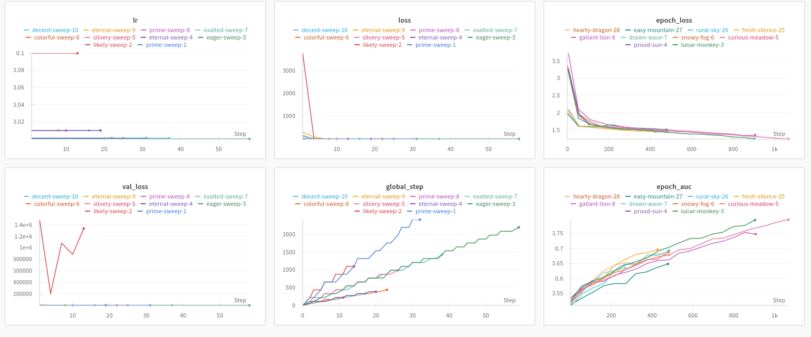
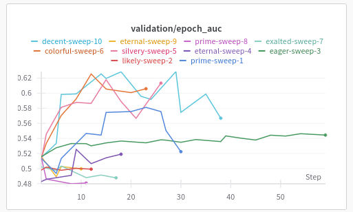
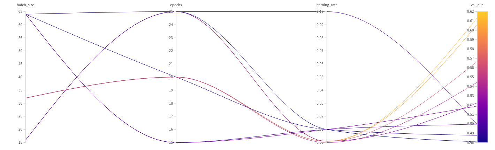
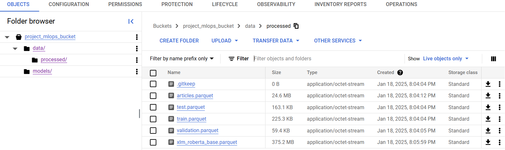
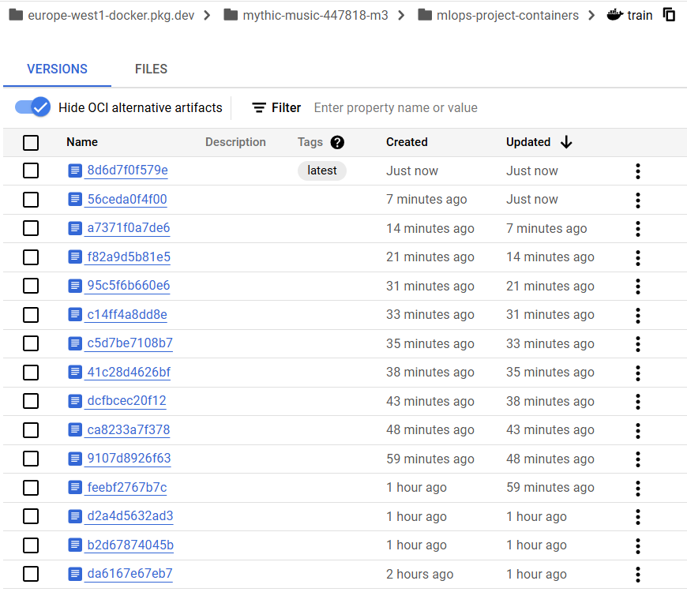
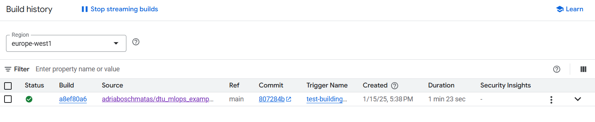
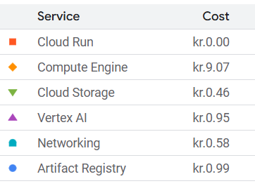

# Exam template for 02476 Machine Learning Operations

This is the report template for the exam. Please only remove the text formatted as with three dashes in front and behind
like:

```--- question 1 fill here ---```

Where you instead should add your answers. Any other changes may have unwanted consequences when your report is
auto-generated at the end of the course. For questions where you are asked to include images, start by adding the image
to the `figures` subfolder (please only use `.png`, `.jpg` or `.jpeg`) and then add the following code in your answer:

```markdown

```

In addition to this markdown file, we also provide the `report.py` script that provides two utility functions:

Running:

```bash
python report.py html
```

Will generate a `.html` page of your report. After the deadline for answering this template, we will auto-scrape
everything in this `reports` folder and then use this utility to generate a `.html` page that will be your serve
as your final hand-in.

Running

```bash
python report.py check
```

Will check your answers in this template against the constraints listed for each question e.g. is your answer too
short, too long, or have you included an image when asked. For both functions to work you mustn't rename anything.
The script has two dependencies that can be installed with

```bash
pip install typer markdown
```

## Overall project checklist

The checklist is *exhaustive* which means that it includes everything that you could do on the project included in the
curriculum in this course. Therefore, we do not expect at all that you have checked all boxes at the end of the project.
The parenthesis at the end indicates what module the bullet point is related to. Please be honest in your answers, we
will check the repositories and the code to verify your answers.

### Week 1

* [x] Create a git repository (M5)
* [x] Make sure that all team members have write access to the GitHub repository (M5)
* [x] Create a dedicated environment for you project to keep track of your packages (M2)
* [x] Create the initial file structure using cookiecutter with an appropriate template (M6)
* [x] Fill out the `data.py` file such that it downloads whatever data you need and preprocesses it (if necessary) (M6)
* [x] Add a model to `model.py` and a training procedure to `train.py` and get that running (M6)
* [x] Remember to fill out the `requirements.txt` and `requirements_dev.txt` file with whatever dependencies that you
    are using (M2+M6)
* [x] Remember to comply with good coding practices (`pep8`) while doing the project (M7)
* [ ] Do a bit of code typing and remember to document essential parts of your code (M7)
* [x] Setup version control for your data or part of your data (M8) **Adri**
* [ ] Add command line interfaces and project commands to your code where it makes sense (M9) 
* [x] Construct one or multiple docker files for your code (M10) **Paula**
* [x] Build the docker files locally and make sure they work as intended (M10) **Paula**
* [ ] Write one or multiple configurations files for your experiments (M11)
* [ ] Used Hydra to load the configurations and manage your hyperparameters (M11)
* [ ] Use profiling to optimize your code (M12)  
* [X] Use logging to log important events in your code (M14) **Jofre**
* [X] Use Weights & Biases to log training progress and other important metrics/artifacts in your code (M14) **Jofre**
* [X] Consider running a hyperparameter optimization sweep (M14) **Jofre**
* [ ] Use PyTorch-lightning (if applicable) to reduce the amount of boilerplate in your code (M15)

### Week 2

* [X] Write unit tests related to the data part of your code (M16) **Edgar**
* [X] Write unit tests related to model construction and or model training (M16) **Edgar**
* [X] Calculate the code coverage (M16) **Edgar**
* [X] Get some continuous integration running on the GitHub repository (M17) **Edgar**
* [X] Add caching and multi-os/python/pytorch testing to your continuous integration (M17) 
* [ ] Add a linting step to your continuous integration (M17) 
* [ ] Add pre-commit hooks to your version control setup (M18)
* [X] Add a continues workflow that triggers when data changes (M19) **Adri**
* [X] Add a continues workflow that triggers when changes to the model registry is made (M19) **Jofre**
* [X] Create a data storage in GCP Bucket for your data and link this with your data version control setup (M21) **Adri**
* [x] Create a trigger workflow for automatically building your docker images (M21) **Paula**
* [X] Get your model training in GCP using either the Engine or Vertex AI (M21) **Adri**
* [x] Create a FastAPI application that can do inference using your model (M22) **Paula**
* [ ] Deploy your model in GCP using either Functions or Run as the backend (M23) **Adri**
* [x] Write API tests for your application and setup continues integration for these (M24) **Paula**
* [ ] Load test your application (M24)
* [ ] Create a more specialized ML-deployment API using either ONNX or BentoML, or both (M25) **Jofre**
* [ ] Create a frontend for your API (M26)

### Week 3

* [ ] Check how robust your model is towards data drifting (M27)
* [ ] Deploy to the cloud a drift detection API (M27)
* [ ] Instrument your API with a couple of system metrics (M28)
* [ ] Setup cloud monitoring of your instrumented application (M28) 
* [ ] Create one or more alert systems in GCP to alert you if your app is not behaving correctly (M28) 
* [ ] If applicable, optimize the performance of your data loading using distributed data loading (M29)
* [ ] If applicable, optimize the performance of your training pipeline by using distributed training (M30)
* [ ] Play around with quantization, compilation and pruning for you trained models to increase inference speed (M31)

### Extra

* [ ] Write some documentation for your application (M32)
* [ ] Publish the documentation to GitHub Pages (M32)
* [ ] Revisit your initial project description. Did the project turn out as you wanted?
* [ ] Create an architectural diagram over your MLOps pipeline
* [ ] Make sure all group members have an understanding about all parts of the project
* [x] Uploaded all your code to GitHub

## Group information

### Question 1
> **Enter the group number you signed up on <learn.inside.dtu.dk>**
>
> Answer:

73

### Question 2
> **Enter the study number for each member in the group**
>
> Example:
>
> *sXXXXXX, sXXXXXX, sXXXXXX*
>
> Answer:

s233219, s242781, s232775, s240661


### Question 3
> **A requirement to the project is that you include a third-party package not covered in the course. What framework**
> **did you choose to work with and did it help you complete the project?**
>
> Recommended answer length: 100-200 words.
>
> Example:
> *We used the third-party framework ... in our project. We used functionality ... and functionality ... from the*
> *package to do ... and ... in our project*.
>
> Answer:

In our project, we used the third-party framework *TensorFlow*. It is an open-source machine learning library that provides different tools for building, training and testing ML models. In our case, it enabled us to adapt the baseline implementation of the news recommender system (Ebnerd) provided for the RecSys Challenge by Ekstra Bladet (as we explained in our project description). By incorporating TensorFlow, we could train and fine-tune the model, benefiting from its robust support for multi-head attention layers. Additionally, this framework allowed us to experiment with different hyperparameters, specially after using the Weights & Biases tool. 

Thanks to TensorFlow, we could optimize the model's performance and also made a faster pipeline and more reproducible. 


## Coding environment

> In the following section we are interested in learning more about you local development environment. This includes
> how you managed dependencies, the structure of your code and how you managed code quality.

### Question 4

> **Explain how you managed dependencies in your project? Explain the process a new team member would have to go**
> **through to get an exact copy of your environment.**
>
> Recommended answer length: 100-200 words
>
> Example:
> *We used ... for managing our dependencies. The list of dependencies was auto-generated using ... . To get a*
> *complete copy of our development environment, one would have to run the following commands*
>
> Answer:

In our project, we used requirements.txt, requirements_dev.txt and requirements_test.txt to manage the dependencies. These are text files which contain a list of all the packages that we have been using for doing the project. The requirements.txt file was generated automatically thanks to a package called *pipreqs*. 

Therefore, if a new member joins our team, the first needed step is to clone the repository and check the requirements.txt file. We also recommend to create a virtual environment to isolate dependencies. Afterwards, the new member should activate this new created environment and install all the dependencies using `pip install -r requirements.txt`. Thanks to this process, the new member's environment will mirror the project's dependencies.

### Question 5

> **We expect that you initialized your project using the cookiecutter template. Explain the overall structure of your**
> **code. What did you fill out? Did you deviate from the template in some way?**
>
> Recommended answer length: 100-200 words
>
> From the cookiecutter template we have filled out the main folders that contain the main files of every machine learning project: folder that contain the main python files to run the model, dockerfiles folder, .github folder to define the workflows for github actions and tests. 
We have added the following folders: wandb and .dvc to perform the data monitoring and data version control in google cloud.
>
> Answer:

--- question 5 fill here ---

### Question 6

> **Did you implement any rules for code quality and format? What about typing and documentation? Additionally,**
> **explain with your own words why these concepts matters in larger projects.**
>
> Recommended answer length: 100-200 words.
>
> Example:
> *We used ... for linting and ... for formatting. We also used ... for typing and ... for documentation. These*
> *concepts are important in larger projects because ... . For example, typing ...*
>
> Answer:

In order to have code quality and formatting rules in our project, we used *Ruff*. It is important to have these rules while developing a project because, formatting enhaces readability making it easier for team members to understand and contribute on the codebase. Moreover, it ensures a uniform structure at the same time that reduces confusion and possible errors caused because of the styling. On the other hand, the code quality rules can help to identify potential issues in early stages so that the code meets specific standards and is less likely to have errors.

## Version control

> In the following section we are interested in how version control was used in your project during development to
> corporate and increase the quality of your code.

### Question 7

> **How many tests did you implement and what are they testing in your code?**
>
> Recommended answer length: 50-100 words.
>
> Example:
> *In total we have implemented X tests. Primarily we are testing ... and ... as these the most critical parts of our*
> *application but also ... .*
>
> Answer:

We implemented a total of 8 tests using pytest to ensure the robustness and reliability of the machine learning pipeline, covering data, model, and training aspects. For data testing, we verified the dimensions of the train, test, and validation datasets, checked for missing or invalid values, and ensured correct formatting. On the model side, we tested that the model weights were imported correctly and that the model's performance surpassed an arbitrary threshold. For the training process, unit tests were conducted to ensure the model was created correctly, the data was properly loaded into the model, and the model was able to be trained successfully. 

### Question 8

> **What is the total code coverage (in percentage) of your code? If your code had a code coverage of 100% (or close**
> **to), would you still trust it to be error free? Explain you reasoning.**
>
> Recommended answer length: 100-200 words.
>
> Example:
> *The total code coverage of code is X%, which includes all our source code. We are far from 100% coverage of our **
> *code and even if we were then...*
>
> Answer:

--- question 8 fill here ---

### Question 9

> **Did you workflow include using branches and pull requests? If yes, explain how. If not, explain how branches and**
> **pull request can help improve version control.**
>
> Recommended answer length: 100-200 words.
>
> Example:
> *We made use of both branches and PRs in our project. In our group, each member had an branch that they worked on in*
> *addition to the main branch. To merge code we ...*
>
> Answer:

Yes, our workflow involved multiples branches and pull requests. We have the main branch where the whole principal code is and then, each of us created a branch for themselves so that we could work individually with our own tasks without afecting the others'. Additionally, since each member had several tasks, some of us created more feature branches to not mix them. Moreover, to protect the main branch, we set that no one could do `git push` directly from the main making the *pull requests* mandatory. Therefore, after each implementation, each of us was doing pull requests for code review and discussion before applying the changes into the ain. Thanks to this, we ensured a controllled and collaborative approach to incorporate new code.

### Question 10

> **Did you use DVC for managing data in your project? If yes, then how did it improve your project to have version**
> **control of your data. If no, explain a case where it would be beneficial to have version control of your data.**
>
> Recommended answer length: 100-200 words.
>
> Example:
> *We did make use of DVC in the following way: ... . In the end it helped us in ... for controlling ... part of our*
> *pipeline*
>
> Answer:

We did make use of DVC for version control: we added a pointer into our Google Cloud data bucket to read the data from there instead to store it locally or in Github, which would be highly inefficient. Additionally, we implemented a data workflow that triggers every time we change anything in the data folder in the cloud. This is how we integrated continuously data versioning into our pipeline.

### Question 11

> **Discuss you continuous integration setup. What kind of continuous integration are you running (unittesting,**
> **linting, etc.)? Do you test multiple operating systems, Python  version etc. Do you make use of caching? Feel free**
> **to insert a link to one of your GitHub actions workflow.**
>
> Recommended answer length: 200-300 words.
>
> Example:
> *We have organized our continuous integration into 3 separate files: one for doing ..., one for running ... testing*
> *and one for running ... . In particular for our ..., we used ... .An example of a triggered workflow can be seen*
> *here: <weblink>*
>
> Answer:

To ensure a comprehensive testing and try to keep code quality, we decided to structure our continuous integration into workflows. In our case, we have four different ones:

- *Docker Image CI*: it automates building and pushing Docker images to Google Cloud Artifact Registry, ensuring up-to-date deployment of the model and backend application with each change to the main branch.
- *Check staged model*: it is triggered from wandb whenever there is a change in the model-weights uploaded in the platform. This workflow is defined in the file workflow_wandb.yaml. In short terms, the workflow provides as an output the information relative to the modification of the weights in wandb.
- *DVC Workflow*: As mentioned in the previous question, we are using a workflow to ensure every time we change something into the data folder in the cloud bucket, it is well integrated in our pipeline and can run without errors. The data is now read from google cloud, and our local repositories can read it directly from the cloud as well. So there is no need to download it avery time.
- *Test FastAPI API*: it ensures that the simple first API that we built works correctly providing feedback. 

## Running code and tracking experiments

> In the following section we are interested in learning more about the experimental setup for running your code and
> especially the reproducibility of your experiments.

### Question 12

> **How did you configure experiments? Did you make use of config files? Explain with coding examples of how you would**
> **run a experiment.**
>
> Recommended answer length: 50-100 words.
>
> Example:
> *We used a simple argparser, that worked in the following way: Python  my_script.py --lr 1e-3 --batch_size 25*
>
> Answer:

We used an arg_parser, implemented in the train_wandb.py file, inside the src/nrms_mlops folder. The code example of the argparse configuration for each experiment is the following:

<br/>python src/nrms_ml_ops/train_wandb.py --batch_size=32 --epochs=20 --learning_rate=1e-05
<br/>The argparser is used during the WANDB sweep, which is referenced later. During this sweep we use a config file, sweep.yaml, inside the folder configs, in which we specify the value of the hyperparameters to try. Basically we tried the following values:
<br/>- Learning rate: 1e-5, 1e-4, 1e-3, 1e-2, 1e-1.
<br/>- Batch size: 16, 32, 64
<br/>- Epochs: 10, 15, 20, 25


### Question 13

> **Reproducibility of experiments are important. Related to the last question, how did you secure that no information**
> **is lost when running experiments and that your experiments are reproducible?**
>
> Recommended answer length: 100-200 words.
>
> Example:
> *We made use of config files. Whenever an experiment is run the following happens: ... . To reproduce an experiment*
> *one would have to do ...*
>
> Answer:

When an experiment is run using the wandb training script (train_wandb.py), inside the wandb folder the experiment is registered authomatically. A folder is created, with the timestamp of the experiment as the name, as well as the identifier of the run for the wandb platform. Inside this folder the wandb infrastructure already creates a files folder, which then contains a config yaml file. Inside this yaml file we can find the value used for each hyperparameter, including as well other features, such as the system where the file has been executed. This way we can keep track of each of the experiments done. 

I<br/>nside this folder, the weights of the model are also stored, in a .h5 file. We can also check the logging output of each case, seeing the evolution of the training and other logging events we added. Then, in the WANDB platform we can further analyze the results.
<br/>To reproduce the experiment, one would have to call the train_wandb.py file, and include the hyperparameters specified in the config file, passing them as argparse arguments, as specified in the previous question. 

### Question 14

> **Upload 1 to 3 screenshots that show the experiments that you have done in W&B (or another experiment tracking**
> **service of your choice). This may include loss graphs, logged images, hyperparameter sweeps etc. You can take**
> **inspiration from [this figure](figures/wandb.png). Explain what metrics you are tracking and why they are**
> **important.**
>
> Recommended answer length: 200-300 words + 1 to 3 screenshots.
>
> Example:
> *As seen in the first image when have tracked ... and ... which both inform us about ... in our experiments.*
> *As seen in the second image we are also tracking ... and ...*
>
> Answer:
We have done multiple runs, which can be analyzed in the wandb framework. Some first visualizations can be seen in the following image:
.
<br/>In the previous image we can see that the training loss and AUC (epoch loss and AUC) keeps decreasing and improving respectively as the step is increased, as expected, meaning that the model is indeed learning from the data. 
<br/>When looking at the Validation AUC we see a different result:

Basically, the validation AUC keeps increasing, until it reaches a maximum, then three epochs later the training is stopped. This is due to the early stopping feature, which has a patience of 3 epochs, in order to avoid overfitting. 
<br/>To find the optimal hyperparameters we realized a sweep based on the config file sweep.yaml, which we have already explained. Doing so, the results of the sweep can be seen in the following image:

<br/>The image is a nice visualization offered by wandb, where we can see the results yielded by the different combinations of hyperparameter, in terms of the validation AUC, which is the most important metric. Doing so, we can see that the best configuration corresponds to a Batch size of 32, 20 Epochs, and a learning rate of 0.001. The validation AUC obtained for this combination corresponds to 0.61. It might not seem a high value, however in the context of the project implemented it is indeed an accepted value, when looking at other available implementations in github. 
<br/> We also logged the model weights as artifacts to the wandb platform, so that they can be downloaded and accessible. Actually, a registry was created based on these artifacts, which was then added in the continuous integration part of the project.
<br/>We had some trouble when implementing, given that our base model is coded in Tensorflow, and the wandb instructions provided in the course are meant for Pytorch projects. However, we managed to implement it satisfactorily. 

### Question 15

> **Docker is an important tool for creating containerized applications. Explain how you used docker in your**
> **experiments/project? Include how you would run your docker images and include a link to one of your docker files.**
>
> Recommended answer length: 100-200 words.
>
> Example:
> *For our project we developed several images: one for training, inference and deployment. For example to run the*
> *training docker image: `docker run trainer:latest lr=1e-3 batch_size=64`. Link to docker file: <weblink>*
>
> Answer:

To run our experiments, Docker was essential for creating containerized environments, ensuring consistency and reproducibility. We developed Docker images for both the training and evaluation stages. For running the training Docker image, we used Docker Compose to simplify the management of multi-container setups and automate the build and execution processes. This allowed us to define and run the training pipeline with a single configuration file, ensuring seamless orchestration. The following commands were used:

`docker-compose build train` 

`docker-compose up train`  

The key advantage of using Docker images is that each one contains all the necessary dependencies, libraries, and configurations, ensuring uniformity across project executions. The train Dockerfile encapsulates the environment setup, providing a standardized and reproducible workflow for experimentation.

### Question 16

> **When running into bugs while trying to run your experiments, how did you perform debugging? Additionally, did you**
> **try to profile your code or do you think it is already perfect?**
>
> Recommended answer length: 100-200 words.
>
> Example:
> *Debugging method was dependent on group member. Some just used ... and others used ... . We did a single profiling*
> *run of our main code at some point that showed ...*
>
> Answer:

When runing into bugs we could generally find them with the tracebacks provided by python. Other times, printing some variables in the python files was enough to find the errors. When none of these worked, we used the Python debugger extension from VS Code which allowed us to further debug our errors more successfully.

## Working in the cloud

> In the following section we would like to know more about your experience when developing in the cloud.

### Question 17

> **List all the GCP services that you made use of in your project and shortly explain what each service does?**
>
> Recommended answer length: 50-200 words.
>
> Example:
> *We used the following two services: Engine and Bucket. Engine is used for... and Bucket is used for...*
>
> Answer:

We used the following services: Compute Engine, Cloud Storage, Vertex AI, Artifact Registry, and IAM & Admin. Compute Engine is used for creating and managing virtual machines to run various workloads, providing flexibility and scalability for custom configurations. Cloud Storage is used for managing buckets to store and retrieve data, including files and objects. Vertex AI is used to run machine learning jobs, providing tools and managed services to develop, deploy, and monitor ML models. Artifact Registry is used to store and manage Docker containers, ensuring version control and integration with other Google Cloud services. IAM & Admin is used to manage user and service accounts, to secure access control and proper role assignment across all services.

### Question 18

> **The backbone of GCP is the Compute engine. Explained how you made use of this service and what type of VMs**
> **you used?**
>
> Recommended answer length: 100-200 words.
>
> Example:
> *We used the compute engine to run our ... . We used instances with the following hardware: ... and we started the*
> *using a custom container: ...*
>
> Answer:

We did not use the GCP Compute Engine because we prefered VertexAI, a managed machine learning platform that simplifies the process of building, training, deploying, and managing ML models. With VertexAI, scaling the experiments is much better because you don't need to manually start, setup and stop a separate VM for each experiment.

### Question 19

> **Insert 1-2 images of your GCP bucket, such that we can see what data you have stored in it.**
> **You can take inspiration from [this figure](figures/bucket.png).**
>
> Answer:



### Question 20

> **Upload 1-2 images of your GCP artifact registry, such that we can see the different docker images that you have**
> **stored. You can take inspiration from [this figure](figures/registry.png).**
>
> Answer:



### Question 21

> **Upload 1-2 images of your GCP cloud build history, so we can see the history of the images that have been build in**
> **your project. You can take inspiration from [this figure](figures/build.png).**
>
> Answer:



### Question 22

> **Did you manage to train your model in the cloud using either the Engine or Vertex AI? If yes, explain how you did**
> **it. If not, describe why.**
>
> Recommended answer length: 100-200 words.
>
> Example:
> *We managed to train our model in the cloud using the Engine. We did this by ... . The reason we choose the Engine*
> *was because ...*
>
> Answer:

We trained the model in Vertex AI by running a custom training job that executed a Docker container stored in Artifact Registry. The container contained the training script and dependencies, processed data from Cloud Storage, and saved outputs back to Cloud Storage.

## Deployment

### Question 23

> **Did you manage to write an API for your model? If yes, explain how you did it and if you did anything special. If**
> **not, explain how you would do it.**
>
> Recommended answer length: 100-200 words.
>
> Example:
> *We did manage to write an API for our model. We used FastAPI to do this. We did this by ... . We also added ...*
> *to the API to make it more ...*
>
> Answer:

We managed to write an API for our model using *FastAPI* and containerized it using Docker. The API allows users to upload a parquet file containing test data so that then is processed to generate predictions and inform the AUC. The model weights are loaded from Google Cloud Storage (GCS) and the FastAPI application is configured to handle file uploads, validate the file format, and make predictions using the model resulted from our training and uploaded in GCS. The Docker image installs the necessary dependencies and it is also optimized for efficient execution. Once the image is created, it is pushed to Google Artifact Registry through our CI pipeline ensuring seamless deployment and continuous integration of the code. In addition, we implemented an error handling procedure to ensure robust operation and easy scalability across environments. Since we couldn't implement any frontend for the API, to be able to execute it we used the UI of the FastAPI library adding `/docs/` after the uvicorn link generated.

### Question 24

> **Did you manage to deploy your API, either in locally or cloud? If not, describe why. If yes, describe how and**
> **preferably how you invoke your deployed service?**
>
> Recommended answer length: 100-200 words.
>
> Example:
> *For deployment we wrapped our model into application using ... . We first tried locally serving the model, which*
> *worked. Afterwards we deployed it in the cloud, using ... . To invoke the service an user would call*
> *`curl -X POST -F "file=@file.json"<weburl>`*
>
> Answer:

We packed our API application into a Docker image and uploaded it to Google Artifact Registry, preparing it for cloud deployment. While we didn't run the API directly from a cloud-hosted instance, some of the needed steps to performe an actual deployment were achieved. However, we could test the API created locally to ensure that the model loaded correctly and accurately predicted the AUC for the data that the user imported. This setup ensured us that the API could be hosted on a cloud instance but a properly frontend could be useful. To invoke the service, we mainly used the default UI from FastAPI where we could upload the parquet data and then, the API gave back the resulting AUC. Moreover, it could be done through the terminal using the `/predict/` endpoint thanks to the command: `curl -X POST -F "file=path/to/the/ptest.parquet" http://127.0.0.1:8000/predict/`


### Question 25

> **Did you perform any unit testing and load testing of your API? If yes, explain how you did it and what results for**
> **the load testing did you get. If not, explain how you would do it.**
>
> Recommended answer length: 100-200 words.
>
> Example:
> *For unit testing we used ... and for load testing we used ... . The results of the load testing showed that ...*
> *before the service crashed.*
>
> Answer:

--- question 25 fill here ---

### Question 26

> **Did you manage to implement monitoring of your deployed model? If yes, explain how it works. If not, explain how**
> **monitoring would help the longevity of your application.**
>
> Recommended answer length: 100-200 words.
>
> Example:
> *We did not manage to implement monitoring. We would like to have monitoring implemented such that over time we could*
> *measure ... and ... that would inform us about this ... behaviour of our application.*
>
> Answer:

We did not manage to implement monitoring. Monitoring would help us detect issues such as data drift, degraded performance, and unexpected behaviors in real time. It ensures our model remains reliable by triggering retraining or adjustments when anomalies like data drift or target drift occur. Additionally, monitoring classic metrics such as latency, error rates, and throughput would allow us to maintain the overall health of the application, ensuring its longevity and user satisfaction.

## Overall discussion of project

> In the following section we would like you to think about the general structure of your project.

### Question 27

> **How many credits did you end up using during the project and what service was most expensive? In general what do**
> **you think about working in the cloud?**
>
> Recommended answer length: 100-200 words.
>
> Example:
> *Group member 1 used ..., Group member 2 used ..., in total ... credits was spend during development. The service*
> *costing the most was ... due to ... . Working in the cloud was ...*
>
> Answer:

The credits used are shown in the picture , totalling 12.04 kr. The service costing the most was the compute engine by far because it provides dedicated virtual machines with customizable resources like CPU, GPU, memory, and storage.

### Question 28

> **Did you implement anything extra in your project that is not covered by other questions? Maybe you implemented**
> **a frontend for your API, use extra version control features, a drift detection service, a kubernetes cluster etc.**
> **If yes, explain what you did and why.**
>
> Recommended answer length: 0-200 words.
>
> Example:
> *We implemented a frontend for our API. We did this because we wanted to show the user ... . The frontend was*
> *implemented using ...*
>
> Answer:

--- question 28 fill here ---

### Question 29

> **Include a figure that describes the overall architecture of your system and what services that you make use of.**
> **You can take inspiration from [this figure](figures/overview.png). Additionally, in your own words, explain the**
> **overall steps in figure.**
>
> Recommended answer length: 200-400 words
>
> Example:
>
> *The starting point of the diagram is our local setup, where we integrated ... and ... and ... into our code.*
> *Whenever we commit code and push to GitHub, it auto triggers ... and ... . From there the diagram shows ...*
>
> Answer:

--- question 29 fill here ---

### Question 30

> **Discuss the overall struggles of the project. Where did you spend most time and what did you do to overcome these**
> **challenges?**
>
> Recommended answer length: 200-400 words.
>
> Example:
> *The biggest challenges in the project was using ... tool to do ... . The reason for this was ...*
>
> Answer:

We tried to implement as well an ONNX version of the model, for having the API running this model. However, given that our model is coded in Tensorflow, and that the instructions of the course are mainly based for Pytorch projects when regarding the ONNX, we had some troubles when obtaining the ONNX version. A similar problem happened when implementing the wandb framework to our model. 

Another big challenge during the project was to integrate all the work that each of was doing at the same time. We needed a lot of comunication because some tasks depended on others that they maybe were performed by other team members. We are referring mainly with the Cloud, because at a certain point we all needed to be able to upload stuff that we did locally to the cloud.

Another big challenge was keeping up with all the contents of this short course as well as implementing all the tools in our project. This required an extremely intense three week period which was an exercise of hard work and persistence.

### Question 31

> **State the individual contributions of each team member. This is required information from DTU, because we need to**
> **make sure all members contributed actively to the project**
>
> Recommended answer length: 50-200 words.
>
> Example:
> *Student sXXXXXX was in charge of developing of setting up the initial cookie cutter project and developing of the*
> *docker containers for training our applications.*
> *Student sXXXXXX was in charge of training our models in the cloud and deploying them afterwards.*
> *All members contributed to code by...*
>
> Answer:

Student *s233219* was in charge of everything related to Docker, using it locally and also adding the files to the cloud. Moreover, the workflows related to check the construction of the Docker images and upload them to the cloud was their job. This student also worked with the API and everything related to it.

Student *s232775* was in charge of the data version control and the managing of the google cloud account where all the services were run. This student made sure the team used all the tools required to scale the project in the cloud, and designed workflow tests integrated with the cloud through Github Secrets where we stored GCP's API key.


All the team contributed with their own branches during the development. We all also write the report together.